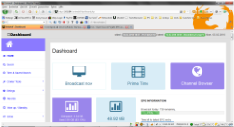

# Uniwebif
Extern and Universal Webinterface for Enigma2 Linux Receiver

If you're not happy with the Webinterface from your E2 Receiver, you should have a look at it.

Overview of the functions:

- Easy accurate search within EPG data
- Generate automatically Auto Timer for desired broadcasts  
- Send timer to any Enigma2 Receiver in your network
- Manage recorded Broadcasts on any existing Receiver
- Operating E2 Plugins like EPG Refresh or Auto Timer on each device not longer necessary
- Optimized by Bootstrap for mobile devices

For hosting the script, i've used a Raspberry Pi Modell B with 512mB RAM. So less ressources are needed.

Requirements on Server/Webspace:

- Webserver like Apache2, nginx eg. with PHP5
- Activated mysqli module for the SQL Database
- Activated allow_url_fopen for the usage from file_get_contents, to get the XML files from Receiver

Uniwebif was compatible with DVB-C, DVB-S, DVB-T Enigma2 Receiver.

Watch Tutorial: https://youtube.com/watch?v=lj4EOlJzquk

Online Demo: http://uniwebif-demo.techweb.at/dashboard.php

Tags: EPG Crawler, EPG Browser, EPG to SQL
